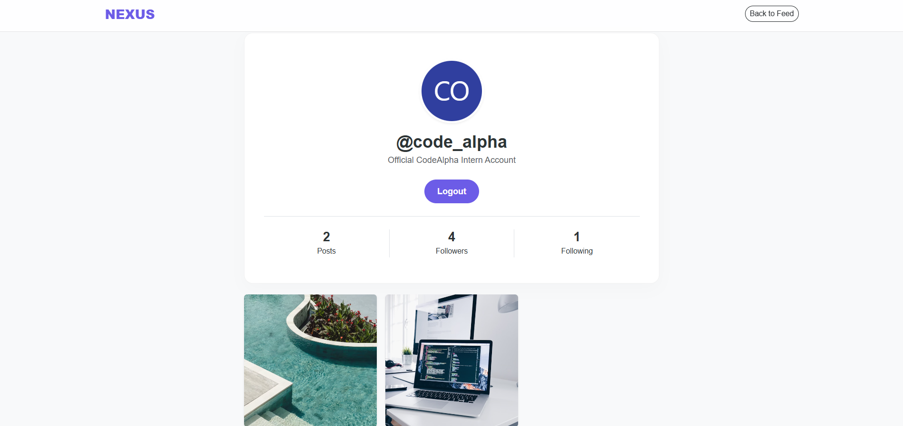

# Nexus - Social Media Dashboard  
**CodeAlpha Internship – Task 2**

Nexus is a full-stack social media application built to enable real-time digital interaction. The platform follows a structured MVC (Model-View-Controller) architecture and includes interactive feeds, visitable user profiles, and a persistent messaging system. This project focuses on building a scalable backend with dynamic frontend behavior to simulate real-world social networking functionality.

---

## Project Demo

Click the image below to watch the full project walkthrough on LinkedIn.

---

## Features

### User Authentication
- Secure user registration and login system  
- Personalized auto-generated user avatars  

### Interactive Feed
- Dynamic post rendering from the database  
- Instagram-style double-tap to like with custom CSS animations  

### Visitable Profiles
- Search and visit any user profile  
- View bio, post grid, and social statistics  

### Social Graph
- Fully functional Follow/Unfollow system  
- Real-time follower and following count updates  

### Direct Messaging
- Dedicated chat interface  
- Persistent conversation history stored in the database  

### Engagement Tools
- Real-time commenting system  
- Create posts with image URL integration  

### UI/UX
- Modern frosted glass navigation bar  
- Clean and consistent purple-themed design using Bootstrap 5 and custom CSS  
- Fully responsive layout  

### Data Seeder
- Script to populate the database with users, posts, and chat histories for demonstration purposes  

---

## Tech Stack

### Frontend
- HTML5  
- CSS3 (Custom Animations)  
- Bootstrap 5  
- Vanilla JavaScript (DOM Manipulation, Fetch API)

### Backend
- Node.js  
- Express.js  

### Database
- MongoDB Atlas (Cloud NoSQL)

### ODM
- Mongoose  

---

## Architecture

The application follows the MVC (Model-View-Controller) pattern:

- **Models** – Define database schemas and structure  
- **Views** – Frontend interface and UI rendering  
- **Controllers** – Handle business logic and API requests  

This separation improves scalability, maintainability, and code organization.

